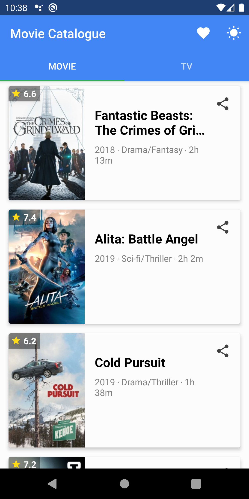
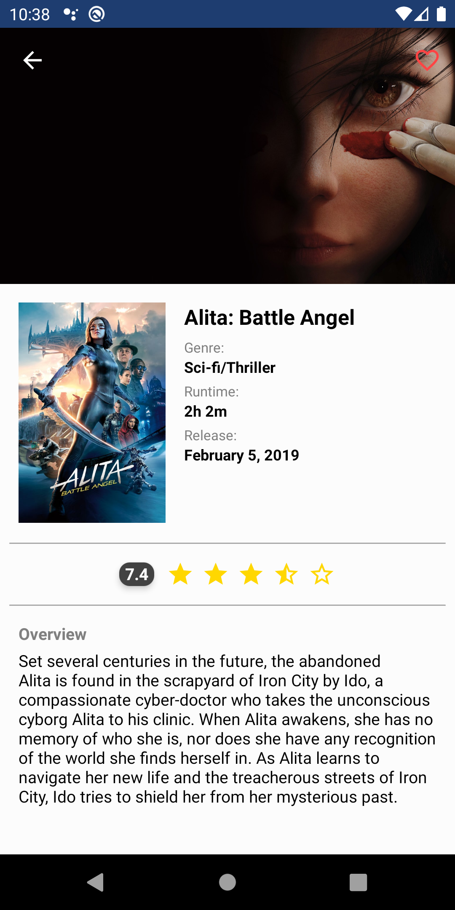

# Movie Catalogue
A simple Movies Catalogue that provides Movies and Series information based on local data.
This Repository is my class assignment at Dicoding Indonesia online course platform at class: Belajar Android Jetpack Pro;
Learning Android Jetpack Pro https://www.dicoding.com/academies/129. I've enrolled in this class as a part of
Google Developers Kejar Indonesia 2019.

## Screenshots
&nbsp;

### App Features
1. Movies & Series
* [x] List of 10 movies & 10 series
* [x] Detail
* [x] Favorite
* [x] Dark Mode

2. App Test
* [x] Unit Test
* [x] Instrumental Test

### Licenses
- [AndroidX](https://developer.android.com/jetpack/androidx)
- [Material Components for Android](https://github.com/material-components/material-components-android)
- [Java](https://docs.oracle.com/en/java/)
- [Glide](https://github.com/bumptech/glide)
- [Room](https://developer.android.com/topic/libraries/architecture/room)
- [Lifecycle-aware components](https://developer.android.com/topic/libraries/architecture/lifecycle)
- [ViewModels](https://developer.android.com/topic/libraries/architecture/viewmodel)
- [LiveData](https://developer.android.com/topic/libraries/architecture/livedata)
- [Paging](https://developer.android.com/topic/libraries/architecture/paging/)
- [Navigation](https://developer.android.com/topic/libraries/architecture/navigation/)
- [RecyclerView](https://developer.android.com/reference/androidx/recyclerview/widget/RecyclerView)
- [Mockito](https://github.com/mockito/mockito)
- [JUnit](https://github.com/junit-team/junit4)
- [Espresso](https://github.com/espressomd/espresso)

## Author
* **Fahmi Al Kautsar**